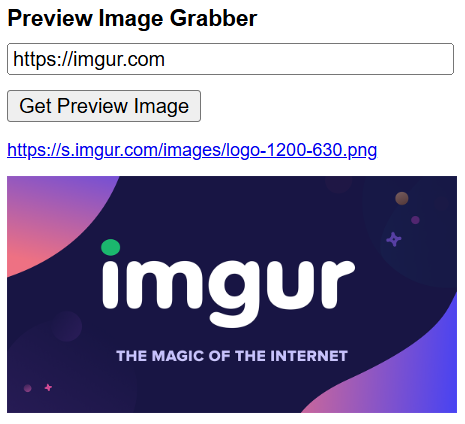

# PIG: Preview Image Grabber </img>

Input a link, get its preview image.
Simple as that!

# Usage

1. Open the chrome extension manager at chrome://extensions/
1. Enable developer mode in the top right corner
1. Click the `Load unpacked` button in the top left
1. Select the extension folder
1. On any page, click the extension icon to the right of the search/url bar at the top of the browser
1. Find the PIG extension and click on it
1. Paste your link into the input box
1. Click the `Get Preview Image` button

(eventually it will be on the chrome web store, making this easier)
